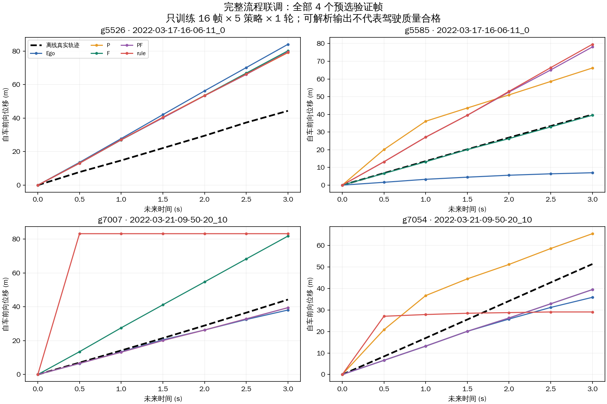

# 完整基础框架：实现、联调结果和正在运行的全量基线

更新：2026-09-11。本轮已把原 CMP MTR、原 V2V-GoT 驾驶器、实际查询循环和训练/评价接成可执行流程，并完成小样本训练、保存恢复、重载生成。全量单配置任务已经启动，尚未完成适配。最终学习查询机制仍是后续研究内容。

## 现在实际运行什么

```text
本车当前/历史特征与状态
  → 本车 MTR 预测和初始证据
  → 选择 STOP / P / F，以及查询区域
  → 实际向邻车服务查询，保存请求、响应和成本
  → 用已返回信息更新证据
  → 再次决策，或因预算/规则停止
  → 构造统一的本车块 + 已查询邻车块
  → 同一个原 GoT 驾驶模型生成未来 3 秒的 6 个点
  → 独立离线评价轨迹误差、失败、调用和成本

独立离线未来位姿 → 训练答案 / 验证答案
已执行的相同输入 → 共享驾驶模型适配 → 保存 → 独立重载生成
```

在线状态不含未来标签，不预读未查询邻车。本车文字块在五种策略间相同；同一个模型接收不同策略实际获得的证据。训练只监督最终答案与 EOS，点云和提示位置不计算损失。

| 策略 | 实际决策过程 | 当前作用 |
| --- | --- | --- |
| Ego | 直接 STOP；没有邻车读取和报文 | 本车独立对照 |
| P | P → 更新 → STOP | 接收当前跟踪状态和历史；本次设置在本车用 MTR 重算 |
| F | F → 更新 → STOP | 使用邻车完整上下文预测后返回查询范围内的目标 |
| PF | P → 更新 → F → 更新 → STOP | 固定两次调用对照 |
| rule | 依据本车速度先 STOP 或 P；再根据实际 P 返回决定 F 或 STOP | 验证结果能够影响后续调用的规则基线 |

规则具体定义和接口在 [实现规格](framework_implementation_v1.md)。单次任务最多 2 次查询；纯观测 P 接收也可执行，但本次统一训练固定使用 `local_mtr`，未展开另一套训练。P/F 的提供方是同机隔离服务，报文实际序列化；没有实车网络测量。

固定 P/PF 的完整 P 可在本地用同一 MTR 得到与 F 相同的邻车预测。这是同信息计算位置对照；规则的 ROI-P 可能缺少 F 在提供方使用的完整上下文。本轮没有联合重跑 Ego+P 的融合预测器，未把“收到 P”限定为必须预测的通用设计。

## 已完成的真实联调

物理录制组按既有 8 个训练组、2 个开发验证组隔离，每组确定性选取 2 帧，共 20 帧。每帧执行 Ego/P/F/PF/rule 五种策略，得到 100 个完整任务；80 条训练样本来自 16 帧，20 条验证输入来自 4 帧。第一次误按 scene 片段抽样的 34 帧尝试保留在 `framework_debug_v1`，修正后的结果是 `framework_debug_v2`。

1. 冻结 CMP MTR 实际执行，100 个任务均完成，Ego 的邻车访问为零。规则在 20 帧中出现 17 次 P→F、1 次 P 后停止、2 次直接停止；并非所有条件都运行固定 PF。
2. 原 GoT 完成总计 10 次优化器更新，累计消费全部 80 条训练行，完成 1 轮和全部 20 条验证损失计算。使用 AdamW、LoRA/projector 学习率 2e-5、有效批量 8。按录制组与策略均衡的验证损失为 0.686655。
3. 保存后继续训练，逐项核验 LoRA、projector、优化器和 CPU/CUDA/Python/NumPy 随机状态恢复一致。独立从原模型连续训练的运行在第一次反向就有细微数值差异，因此不宣称 GPU 跨运行逐位确定性。
4. 从保存的一轮检查点重新加载模型，对预选的全部 4 个验证帧执行五策略生成：20 次均生成可解析的六点轨迹，随后完成离线评价。
5. 独立复算全部 20 条轨迹的 ADE/FDE，核对 100 个任务的实际报文字节、物理划分、容量和本车输入一致性，均通过。完整测试 115 项、轻量测试 87 项通过；独立审查发现的两项 P1 已修复并复审关闭。

小样本训练输出明确记录 `formal_adaptation_complete=false`。10 次更新的作用是验证完整训练流程可用，并不代表共享驾驶器已适配充分。

## 轨迹质量仍需正式适配

下面保留小样本联调的全部结果，防止把“可解析”误写成“驾驶质量合格”。每种策略只有 4 帧；没有用这些数值选策略、选初始化或判断研究方向。

| 策略 | 可解析 / 尝试 | ADE3（米） | FDE3（米） | 平均调用数 | 平均响应字节 |
| --- | ---: | ---: | ---: | ---: | ---: |
| Ego | 4 / 4 | 13.014 | 23.574 | 0 | 0 |
| P | 4 / 4 | 15.520 | 20.214 | 1 | 41711 |
| F | 4 / 4 | 12.639 | 21.479 | 1 | 36706 |
| PF | 4 / 4 | 13.086 | 22.625 | 2 | 78417 |
| rule | 4 / 4 | 29.451 | 34.623 | 2 | 18018 |

当前纵向速度、零转向外推的同帧 ADE3 为 1.175 米。联调模型有明显错误，rule 在 g7007 还生成了六个相同的远距离点。评价保留这些输出和运动学指标；“解析失败为零”不表示物理可行性或任务质量达标。原始二维轨迹全部保存在生成文件，下面展示所有四帧的前向位移随时间变化，没有挑选案例。



输入容量也是现存限制：这 20 帧平均保留本车 2.65 条记录，P/F/PF/rule 分别保留邻车 1.35/2.80/2.30/1.80 条。PF 记录包含来源和模式，可能有同目标重复表达；它不是独立目标数。完整覆盖率和来源记录均保存，不能把当前文字选择称为已优化的融合器。

## 两项审查修复

- 工具任务先保存身份与请求，响应及已发生成本在接收处理之前持久化。已用故障注入确认：P 已返回后本地 MTR 异常，或第二次服务异常，历史账本仍保留。无法确定的部分成本显式标为不完整，失败任务保留在尝试集合内。
- 准备阶段核对每个预选帧与策略的完整集合。生成前保存任务清单，评价要求完成标志、任务数量和身份均一致；缺少生成记录时拒绝发布完整结果。训练导出遇到失败任务会停止，不静默删掉失败条件。

成本包含请求/响应字节、提供方计算、接收处理及驾驶生成。报告中的计算耗时是已测时段之和，本车共享计算按每个对照任务计入一次；不包含模型装载、真实网络传输和原感知预处理，不能当作车辆部署时延。

## 已启动的全量单配置运行

运行目录：[framework_baseline_v1](../outputs/framework_baseline_v1/)。2026-09-11 19:03（UTC+8）已启动独立进程，执行的是该目录 `code/` 中保存的代码；后续工作区编辑不会改变这次运行。阶段顺序为：

```text
3095 帧 × 5 策略的真实任务
  → 独立导出 14935 条训练行和 540 条验证输入
  → 原 GoT 初始化，最多 3 轮共享适配
  → 按录制组/策略均衡的验证答案损失选检查点
  → 全部 108 个开发验证帧 × 5 策略实际生成
  → 统一离线评价
```

训练不使用小样本联调权重。配置固定为 AdamW、LoRA/projector 学习率均 2e-5、有效批量 8、seed 20、梯度裁剪 1、最多 3 轮、patience 2，MTR 冻结。此处的 3095 帧是既有清理后的研究因果索引，包含 2987 个训练帧与 108 个开发验证帧；不是整个原始数据集的全流程复现。

GitHub 提供 [发布时进度快照](../outputs/framework_baseline_v1/progress_at_github_update.json)，它不是实时状态。本机当前阶段读取 `outputs/framework_baseline_v1/status.json` 与 `episodes/progress.json`。启动后的首批任务已执行成功；本文没有把排定的训练、生成或评价写成完成。任一阶段失败会保存错误并停止，不会跳过失败自动宣称完成。

下一次工作先读取该运行状态与产物，继续这一套配置。完成后先判断共享驾驶器是否学会基本任务、是否仍有重复点或明显运动错误，再处理证据覆盖和查询机制。当前规则是功能基线，尚无学习查询策略、RSU/I 或闭环驾驶结果；本轮不提供方法收益或论文可录用结论。

## 入口与产物

| 用途 | 位置 |
| --- | --- |
| 决策、真实查询和停止 | `src/planning/episode.py` |
| 统一驾驶输入 | `src/planning/context.py` |
| 真实任务 / 独立生成 | `src/planning/run_framework.py` |
| 独立监督导出 | `scripts/prepare_framework_training.py` |
| 多样本训练、验证和恢复 | `src/planning/train_driver.py` |
| 完整任务评价 | `src/evaluation/framework.py` |
| 自动顺序运行入口 | `scripts/run_framework_baseline.py` |
| 100 个真实联调任务 | `outputs/framework_debug_v2/` |
| 一轮训练 / 恢复逐项核验 | `outputs/framework_training_epoch_v1/` |
| 20 次原始生成 / 评价 | `outputs/framework_generation_v1/`、`outputs/framework_evaluation_v1/` |
| 独立复算、测试和启动日志 | `outputs/framework_integration_v1/` |

完整基线的可重放命令（新运行须使用新输出目录；当前任务已启动，无需再次执行）：

```bash
OPENBLAS_NUM_THREADS=1 OMP_NUM_THREADS=1 \
  /root/autodl-tmp/conda-envs/llava/bin/python scripts/run_framework_baseline.py \
  outputs/framework_baseline_v2
```

依赖本机现有外部权重、GoT 处理后数据和因果窗口。没有补下原始 V2V4Real，也没有重跑完整 CMP 感知或原 GoT 全任务训练。实际驾驶输入仍是原点云检测特征与文本，没有真实 RGB；直接六点任务没有执行 Q8 或使用 Q8 标签作为父回答。

GitHub 仅上传这次联调的精选文本：全部 20 个验证任务和生成，以及 2 个训练帧的规则提前停止任务。100 项任务索引保留原样，索引中的其他任务、特征及源码快照需要原工作站资源；该精选归档不能直接当作完整输入目录执行。发布检查通过仓库相对位置读取这些原始文本，不重写其历史绝对路径。具体范围见 [更新说明](github_update_framework_2026_09_11.md)。
