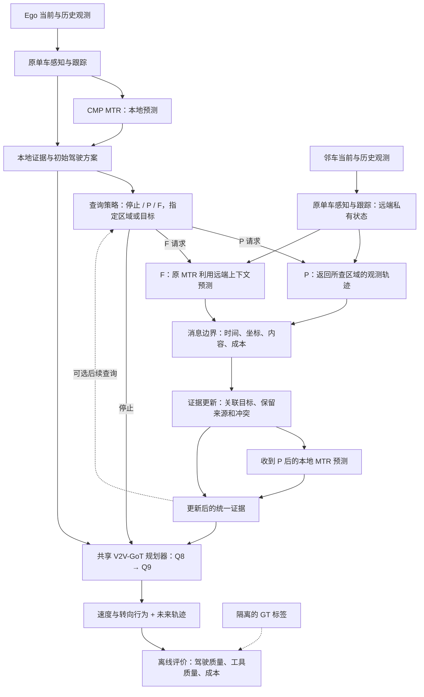

# ToolV2X 框架设计草案

日期：2026-09-10。性质：根据用户“设计一下框架”形成的技术方案。用户随后明确“OK，现在开始”并要求继续，已授权实施。原 V2V-GoT + CMP MTR 的固定 P/F 任务链接入现已完成单帧真实运行，见 [planning_connection.md](planning_connection.md)；尚未适配训练或正式评价，最终查询机制仍未确定。下文描述完整目标设计，不能把所有模块都视为已经实现。

## 1. 推荐方案与研究问题

**以 V2V-GoT 的驾驶任务模型为骨架，以原感知/跟踪模块和 CMP 的原 MTR 为能力底座，在两者之间加入按需查询、证据更新和统一评价。**

第一版研究的问题是：Ego 能否根据当前驾驶决策需要，在邻车的观测结果 P 和预测结果 F 之间选择查询内容，并以合理的通信与计算代价改善规划？结果驱动的后续查询是否必要，留给同框架实验回答。

| 方案 | 能复用什么 | 主要代价 | 本次建议 |
|---|---|---|---|
| V2V-GoT 驾驶模型 + 独立 P/F 服务 | 原点云特征投影、MLLM、Q8/Q9 任务接口；原检测/跟踪、CMP MTR | 需要改输入隔离、证据接口，并训练模型使用新上下文 | 主方案，任务端与工具研究直接对应 |
| CMP 完整协作流水线 + 新增规划器 | 协同感知、预测与聚合流程 | CMP 本身不能完成这里的驾驶任务；仍需规划端，工具边界受原融合流程约束 | 作为固定协作对照和组件来源 |
| 完整 V2V-GoT 图上的 QA 节点直接改名为工具 | 原 QA 图与多车输入 | 原模型已读取多车特征；关闭 QA 节点不能消除通信，原 QA 输入还需因果改造 | 不采用“改节点名”的实现方式 |

原 V2V-GoT 明确使用多车感知特征和父节点回答作为上下文，因此主方案属于对原框架的实质改造。[作者代码说明](https://github.com/eddyhkchiu/V2V-GoT)

第一版固定两辆车、P/F 两种能力、统一规划器。采用真实数据上的开环驾驶任务链；后续再接车车闭环验证。RSU、伙伴意图 I、多车发现与调度不进入本版。这里复用原 MLLM 承担驾驶任务，不意味着已选定用 LLM 或 RL 决定工具调用。

## 2. 总体结构

核心信息边界：Ego 的驾驶模型始终只读取本车原感知特征；邻车的场景内容只能通过已经发生的 P/F 调用进入证据。服务内部即使提前计算了缓存，也不能让查询策略或规划器访问未购买的内容。

## 3. 各模块的明确职责

### 3.1 本车与邻车能力

两车分别使用原框架的单车检测和 AB3DMOT 跟踪，维护自身过去 1 秒、含当前时刻的 11 帧观测窗口。第一版同构能力、同一套 MTR 权重，避免先把模型强弱差异混入工具价值。

Ego 有本地预测能力。STOP 不等于“没有预测”；P 也不能被限制为只能接收位置却不能在本地计算。邻车 F 使用其自身能观测到的目标历史和周边目标上下文，不读取 Ego 的私有数据，也不读取其他车辆的 GT 未来。

短历史、漏检和缺失帧保留有效性标记，不能通过未来插值补足。原 MTR 的因果数据适配与训练应覆盖这些输入情形；临时回退输出必须标识为回退，不能冒充原模型预测。

### 3.2 P：查询观测证据

**主版本建议 P 返回所查目标的当前状态与可用历史轨迹。** 历史仍属于观测证据，P 不运行远端预测。

- 输入：提供者、决策时间、查询区域，或先前调用已经返回的源内目标句柄。
- 返回：查询区域内当前观测目标的源内句柄、3D 框、朝向、检测分数、带时间和有效性标记的过去 1 秒轨迹。
- 保留历史缺失；不把“未返回目标”解释成“该区域安全”。返回查询是否完成、观测范围是否可知、是否截断等状态。
- P 的历史轨迹可用于本地 MTR。接收端能重新组合已获得的观测和本车上下文。

P_current 只发当前状态，作为消息精简消融；不能只用它代表所有合理 P 实现。主 P 版本的历史长度在所有策略之间一致。

### 3.3 F：查询预测证据

F 接受与 P 相同的区域寻址，也接受已获得的源内句柄。因此 **F 可以直接调用**，不依赖先获取远端目标列表。

- 邻车选择查询区域内当前可见的目标，以其本地可用的完整上下文运行原 CMP MTR。
- 返回目标句柄、用于关联的当前定位锚点、预测模式与分数、预测起点和采样时间、预测状态及模型版本。
- 主驾驶任务使用未来 3 秒、每 0.5 秒一个点；从 MTR 原生 5 秒预测中取对应时刻，保留 6 个模式。原生完整输出另外保存，用于预测模块评价。
- 保留原始模式分数及其语义。NMS 后剩余分数不必和为 1；若接收端需要归一化，必须明确这是保留模式内的相对权重，不能称为校准过的概率。
- 第一版消息使用模式均值与分数。原 GMM 参数保存在模块产物中；若后续传输不确定性参数，需要新增明确字段并重新计费。GMM 通道不是速度。
- F 中用于关联的当前位置也属于传输信息和成本。Always-F 具有这些最小定位信息，不能宣称完全未接收感知内容。

F 的价值可能来自保留在远端的更多上下文，也可能来自把计算交给远端。多模式未来轨迹未必比观测历史更小，必须测实际报文，不能预设“F 更省带宽”。

### 3.4 信息等价对照

单独设置 P_full_context：传输 F 对指定目标实际读取的全部观测上下文，Ego 使用相同预处理、目标集合和 MTR 权重重算，随后用相同 F 格式交给规划器。

该对照不能只传目标自身历史，因为原 MTR 还读取其他目标。严格等价时，远端与本地预测应在数值容差内一致；结果相同是对照正确的表现。此时只能讨论传输和计算位置的差别。

另报“P_full_context 的全部已购信息均可供规划器使用”的强 P 对照。这样既能检查纯计算等价，也不人为限制 P 在任务层面的信息优势。

### 3.5 接收与证据更新

接收器首先统一消息时间、坐标和来源，再构造规划器能读取的目标证据表。

- 源内句柄由“提供者 + 序列 + 本地跟踪 ID”组成，不使用跨车 GT ID。
- 跨车关联基于已获得的历史位置、运动与框信息；固定算法和阈值在验证集确定。模糊关联保留候选关系与来源，不能直接视为两个确定不同的目标。
- 同一目标的两份多模式预测分别保留。不能按模式编号逐点平均，因为两车的第一个模式未必表示同一运动方向。
- 远端独有目标进入证据表并传给规划器，不能因 Ego 无对应目标而丢弃。
- 第一版 P 到达后，在同一套 MTR 上分别对可用的 Ego 观测窗口、收到的 P 观测窗口预测，保留来源；对 GT-free 关联后的联合观测重算作为强 P 扩展对照。这样先避免让接收器凭任意平均制造新的运动轨迹。
- PF 同时保留 P 支持的本地预测和 F 返回的预测；来源、可用历史长度、时间和缺失状态一同交给共享规划器。

第一版采用确定的结构化文本序列化接入原 MLLM 上下文，不另发明一个融合网络。固定字段、顺序、时间单位和来源标签；数值证据由解析器产生，不能由另一个 LLM 任意改写。上下文不足时采用统一、只读已获证据的截断规则，记录被截断内容及比例；已经传输的内容仍计入通信成本。

### 3.6 共享驾驶任务模型

复用 V2V-GoT 的原点云感知特征投影、LLaVA 主体和 Q8 → Q9 任务接口：Q8 输出速度/转向类别，Q9 输出未来 3 秒的 6 个轨迹点。这里使用的是点云感知特征形成的 token；原 loader 的占位图像不能描述成真实 RGB 输入。

输入为本车当前/上一帧原感知特征、本车运动状态、当前合法证据和固定任务提示。第一版不假定额外导航路线可用，也不从 GT 未来反推导航。Q9 的上下文采用模型实际生成的 Q8 输出。

需要完成的原框架修改：

1. 原 loader 虽有 ego_only 分支，但 active_agent_mask 写死为两车；需统一单车维度、缺失特征标记和时间边界，并验证加载文件只属于本车。
2. 用因果证据组织器替换原 Q1–Q7 的在线上下文来源。不能把 GT 生成的 notable objects、Q1 的未来参考路径、Q6 的伙伴 GT 未来作为查询依据。
3. 给原模型做任务适配训练，覆盖 STOP/P/F/PF 以及不同 ROI、缺失和冲突证据。不能假设下载权重零样本就理解新的 P/F 字段。
4. 所有工具策略共享这一个训练完成后冻结的规划器、相同解码与解析规则，避免给某策略另配更强任务模型。

轨迹格式错误、数值异常和物理上明显不合理的输出单独记失败。最终输出解析失败时可使用已生成且有效的 Ego 方案回退，并同时报告回退前失败率和回退后成绩；Ego 方案也失败的帧不能悄悄从统计中删除。

## 4. 每个决策时刻怎样运行

**第一步：建立本地认识。** 输入是时间 t 及之前的 Ego 感知/跟踪结果；运行本地 MTR，输出本地场景证据。可用服务目录只包含邻车身份、当下定位和声明的服务能力，不包含其目标列表或风险评分；目录通信也记录成本。

**第二步：产生初始驾驶方案。** 同一个 Q8 → Q9 模型仅根据本地输入产生 Ego 方案。查询可参考这条模型预测路径及本车运动状态；不是实际未来轨迹。各策略共享这一初始步骤，成本一致记录。

**第三步：决定是否查询以及查哪里。** 第一版候选区域包括全范围、前方、左侧、右侧，以及围绕初始方案的走廊。几何定义只依赖当前坐标与预测方案，参数在验证前配置；保留宽范围候选，避免初始方案遗漏某方向后永远不查询该方向。

**第四步：远端执行。** 查询服务只根据邻车截至 t 的观测生成 P 或 F 报文；返回结果经消息边界进入 Ego，记录请求、响应、计算和传输费用。

**第五步：更新证据。** 接收器关联目标、保留远端新增目标和来源冲突；收到 P 时可以调用本地 MTR。得到实际新证据后，查询策略可以停止，也可以作下一次查询。

**第六步：输出最终方案。** 停止后，共享 Q8 → Q9 模型根据已获得的证据输出最终行为和轨迹。STOP 直接复用初始 Ego 方案；完全相同的证据与配置应得到相同结果。

**第七步：隔离评价。** 推理结束后，由独立 evaluator 读取未来 GT，计算预测、规划和成本指标。训练监督可以使用训练集未来标签，但不能通过同一个数据对象泄漏给在线模块。

初始协议每个决策时刻最多两次工具调用，足以覆盖 STOP、P、F、PF，以及结果驱动的第二次查询。PF 是两个已预定的请求，不能把第二个请求偷偷改成依赖第一个结果。序贯策略可改变第二次调用的工具、区域或已知目标；重复读取同一结果不产生新证据。

每帧从独立的 Ego 状态开始，远端证据仅在本次决策内缓存。各车本地历史正常维护。跨决策的远端缓存需要另外定义策略状态与历史通信成本，后续再加，不能让 Always-P 把历史消息免费赠送给其他策略。

## 5. 固定什么，比较什么

| 类别 | 本框架建议 |
|---|---|
| 先固定 | 因果输入、两车同构能力、P/F 语义、消息边界、共享接收器与规划器、数据划分、指标 |
| 先跑通 | 全范围 Ego / Always-P / Always-F / Always-PF、P_full_context、简单几何规则 |
| 在同一链条中比较 | 一次性预定最多两次调用；看到实际结果再选下一次调用；直接 F；不同查询范围 |
| 后续再选实现 | 几何规则、小型监督选择器、基于规划状态的选择头、LLM 调用或 RL |
| 暂不增加 | RSU、I、复杂服务平台、全新预测骨干、全新融合网络 |

“序贯”作为可被否定的机制候选：用相同初始信息、查询候选、最大次数、字节预算和共享任务模型，比较一次性选择与得到第一次实际结果后的选择。只发现 PF 比 P 好，并不能说明第二次查询需要根据结果决定。

主序贯对照先使用共同的 ROI 候选池。P 返回句柄后再精确寻址目标，作为单独的扩展实验；否则会把“获得新目标的寻址能力”和“根据新结果改变选择”混成一个结论。一次性策略可以直接向相同 ROI 请求 F。

DriveAgent-R1 已有主动工具、混合推理和分阶段强化学习，借鉴其先形成工具使用能力、再学选择的训练组织；不能把这些概念本身当成本项目创新。[作者项目页](https://tsinghua-mars-lab.github.io/DriveAgent-R1/)

## 6. 训练顺序与数据来源

1. **先适配原能力模块。** 原 MTR 在因果检测轨迹上训练/微调，覆盖单车上下文、P 查询返回的上下文子集和缺失历史。ego/peer 使用同一权重；完整上下文对照保持相同预处理。必要的时间/角度修正不能只改推理输入而忽略训练分布。
2. **再训练共享驾驶模型使用证据。** 在训练帧上构造各种调用条件，使用真正模型生成的工具输出。训练目标为 Q8 行为与 Q9 轨迹；Q9 上下文逐步使用模型生成的 Q8，不能测试时还使用 GT Q8。均衡工具子集训练，避免模型只学会全量输入模式。对各条件单独报告能力，不能只看混合平均数。
3. **固定能力模块和任务模型，运行强固定对照。** 同一帧配对产生不同动作的驾驶输出，记录新增目标是否到达任务端、实际质量变化、恶化案例和成本。
4. **最后训练选择策略。** 只用训练集的配对结果构造效用监督，必要时用按记录划分的折外结果减少过拟合。验证集选超参数，测试记录封存。一次性和序贯策略均保留，最终结构取决于对照结果。

继承当前按驾驶记录隔离的划分：15 个训练片段、2 个验证片段、9 个测试片段，见 [split_manifest.json](../outputs/protocol_audit/split_manifest.json)。不能因某帧缺少未来 GT 就把它从在线决策集合中删除；各预测时域的评价另报有效标签覆盖。

**原模型结构复用与权重来源是两件事。** 当前检测缓存的训练独立性未确认，已加载的 CMP 权重训练来源未确认，发布的 V2V-GoT 任务权重也需核查是否见过本项目保留记录。框架接入可以使用它们；严格泛化实验应从来源合规的初始化出发，在本项目训练记录上训练相应原结构。若预训练已见过保留记录，仅做一次微调不能消除这个问题。现存缓存可支持注明条件的配对研究，不应包装为整条流水线的未见场景泛化成绩。

## 7. 必须同时具备的对照与评价

| 对照 | 要回答的问题 |
|---|---|
| Ego：本地感知 + 本地 MTR + 同一规划器 | 没有协作时任务能力如何 |
| Always-P / Always-F / Always-PF：全范围固定查询 | 各种真实能力能否被任务模型使用，是否互补或有害 |
| P_full_context 本地重算 F；全部 P 信息开放版本 | 远端信息、远端计算、信息表达各自贡献什么 |
| 几何规则；随机/按成本频率匹配策略 | 按需策略是否超过便宜而强的选择方法 |
| 一次性选择；固定两步调用；结果驱动的第二次调用 | 新结果是否改变了值得做的下一次查询 |
| 离线动作 oracle | 仅表示给定模型、候选与成本下可达到的上限，不能作为在线策略 |
| V2V-GoT 原完整图；CMP 原固定合作配置 | 原系统性能参照；另列协议、信息与计算，不能假装同条件 |

CMP 原系统对照首先报告其原预测任务。要进入同一驾驶任务比较，需明确地把因果适配后的输出接入共享规划器；原聚合器的 GT 对齐、BEV 依赖和 peer-only 目标处理不能用占位数据掩盖。

评价分三层：

- **能力与接收**：原 MTR 的多模态预测误差、远端新增目标覆盖、历史长度、关联错误和证据截断。只在有合法标签处评分，同时报告覆盖率。
- **驾驶任务**：Q8 行为指标、Q9 在 1/2/3 秒的轨迹误差、格式失败、动力学可行性、基于车辆框的开环碰撞代理。GT 轨迹偏差不等于安全；开环碰撞代理也不等于闭环真实碰撞率。主表同时看全量质量和配对恶化比例。
- **成本**：请求与响应实际字节、目录与元数据、本地/远端模型计算、规划 token 与运行时间、串行等待。P/F 使用同一种传输封装和数值精度。预计算只用于加速实验，成本根据对应真实执行另外记录，不能按缓存读取耗时计费。

第一版质量实验采用冻结的时间 t 快照；实测运行时间另报，不能把这一实验称为车辆实时系统。延迟影响用明确的消息到达与数据时效模型另做实验，再接车车闭环平台。报质量—成本曲线，并在预算匹配时比较；不把 Always-PF 预设为质量上界。

统计按独立驾驶记录配对汇总和重采样，不把相邻帧当作独立样本。主结果不根据 GT 挑有利“遮挡关键帧”；这类子集只能用于明确标注的离线诊断。

## 8. 模块落点和现有成果

以下是设计落点，未存在的目录/文件仅表示后续职责，不在本轮创建代码骨架。

| 位置 | 职责 / 复用对象 | 当前状态 |
|---|---|---|
| `src/tracking/`、`src/prediction/causal_windows.py` | 原跟踪、两车因果历史 | 已有输入处理与窗口；仍需配合正式特征来源核验 |
| `vendor/cmp_mtr/`、`src/prediction/cmp_adapter.py` | 原 CMP MotionTransformer 的数据适配与执行 | 已完成真实权重加载和单帧两车前向；不是质量复现 |
| `src/tools/` | P/F 请求、响应、隔离与计费 | 已由 `vehicle.py` 接通真实报文、原 MTR 和完整 P 等价重算 |
| `src/receiver/`（设计职责，当前未单独建目录） | 时间/坐标转换、关联、源分离证据与文本序列化 | 基础接收在 `tools/vehicle.py`，紧凑编码在 `planning/inputs.py`；历史关联和学习融合未完成 |
| `src/planning/` | V2V-GoT 原加载/投影/任务模型适配，Q8/Q9 生成与解析 | 原模型真实运行、紧凑对照及训练数据/监督前向入口已接通；参数适配未开始，见 `evidence_adaptation.md` |
| `src/policies/` | 固定、规则、一次性与序贯查询策略 | 先固定策略，学习机制后置 |
| `src/evaluation/`、独立运行入口 | 配对执行、任务评价、成本账本 | 待统一；旧直线速度缩放不作为主任务模型 |

现有恒速和岭回归结果保留为接口诊断或简单对照，不作为 ToolV2X 生死判断。当前原 MTR 模块接入事实见 [framework_plan.md](framework_plan.md) 和 [module_check.json](../outputs/cmp_module_v1/module_check.json)。

## 9. 搭建顺序与完成标准

**阶段一：接通任务输出端。** 将原 V2V-GoT 改为单车特征与因果任务提示，接入本地 MTR，能生成和解析 Ego 的 Q8/Q9。检查实际读取特征来源及全部上下文；这一阶段允许先用现有权重检查接口，不据此评价工具价值。

**阶段二：把 P/F 接到同一任务端。** 建立查询服务、证据更新与统一规划器，完成真实单帧和多帧的 Ego/P/F/PF 配对输出。检查没有远端旁路、时间越界，远端独有目标和各模式确实进入规划上下文，并完成 P_full_context 数值等价检查。在测试加载器中屏蔽远端场景文件访问后 STOP 仍应能执行；在测试副本中改变未查询的远端场景，不应改变 Ego 输入和输出。

**阶段三：完成原模型适配训练与固定基线评价。** 解决来源独立性、输入分布和新证据使用能力；执行强固定对照，观察完整任务链上的差异。即使结果未改善，也应定位到感知、预测、关联或规划使用证据的具体环节，不由一个自建小模型替整个项目作结论。

**阶段四：比较查询机制。** 能力与任务端固定后，才用同预算对照选择一次性、序贯或更简单机制。明确可被否定的假设：若实际 P 返回没有提供对后续选择有用的信息，就不强行保留两阶段故事。

第一版“框架完成”意味着原能力、工具调用、消息接收、共享驾驶输出、固定对照和统一评价能共同工作，并有运行记录。仅有接口类、缓存结果、单次 MTR 前向或一张架构图都不满足这一标准。

## 10. 本轮核查依据

- [V2V-GoT 单车 loader 分支](/root/autodl-tmp/V2V-GoT/LLaVA/llava/eval/model_vqa_loader.py:334)：按 ego_only 选择车；同文件第 415 行的 active_agent_mask 固定为两车，需要适配。
- [V2V-GoT 点云 token 生成](/root/autodl-tmp/V2V-GoT/LLaVA/llava/model/llava_arch.py:700)：原特征投影与多模态输入路径，可复用而需隔离提供者。
- [V2V-GoT Q9 生成代码](/root/autodl-tmp/V2V-GoT/DMSTrack/V2V4Real/opencood/tools/inference.py:4137)：任务提示本身可不包含未来路径；GT Q8 上下文和预测 Q8 上下文是不同分支，在线只可使用后者。
- [V2V-GoT 原推理链](/root/autodl-tmp/V2V-GoT/LLaVA/scripts/v1_5/inference_v2vgot.sh:88)：Q8 结果用于生成 Q9 上下文；主方案复用这一任务链并替换上游证据来源。
- [CMP 原 MotionTransformer](/root/autodl-tmp/CMP/MTR/mtr/models_v2v4real/model.py:17)：原上下文编码与预测解码；[项目中已有因果适配](/root/autodl-tmp/ToolV2X/src/prediction/cmp_adapter.py)。
- [DriveAgent-R1 叙事核查](driveagent_r1_narrative.md)：能力训练、模式选择及现有近邻边界。

这些依据支持“有明确的原组件复用路径”。适配后是否取得有效任务收益，需要完成上述训练与实验，当前不能预先保证。
