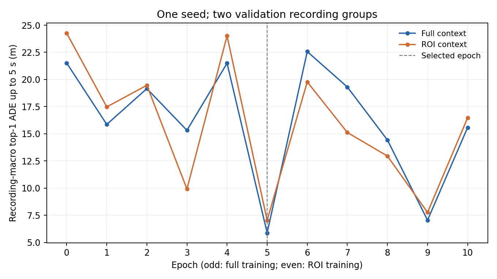

# 原 CMP MTR 因果适配：首轮结果

运行从 2026-09-10 开始、于 2026-09-11 完成。原预测分支经过适配后，两个验证录制组的平均误差均下降；训练存在明显波动，且部分目标变差。本轮是一项单种子的能力适配实验，未验证 ToolV2X 查询机制或驾驶收益。

## 具体实验

- 骨干为 CMP 原 no-coop MotionTransformer（68,514,524 个参数），从已下载权重继续训练；原编码器、解码器、GMM/分类/邻居预测损失保留。未训练 CMP 协同融合或 V2V-GoT 驾驶模型。
- 检测、跟踪缓存固定。每个来源单独提供 11 帧历史，间隔 0.1 秒，坐标固定为 ego(t)。历史有效位仍表示可用的因果跟踪输出，包含 KF 维持状态。
- 当前时刻以 2 米距离、尺寸比例 [0.5,2]、模 pi 朝向差不超过 pi/3 做一对一 GT 匹配；自车原点 1.5 米内排除监督，伙伴车保留。未来 50 步仅用于独立离线标签；不填缺失、不跨片段。
- 训练 8 个录制组/15 个片段，验证 2 个录制组/2 个片段。本轮未读取测试数据；两车来源属于同一组的相关观测，不算独立场景。
- 训练按每 5 帧采样，共 1,220 个来源窗口；验证使用全部 108 个决策帧 × 2 个来源。所有在线目标保留，模型只对至少两帧历史的目标执行，短历史保留既有静止回退；无未来监督目标不作损失中心。
- 奇数轮完整上下文，偶数轮前方 ROI `[0,-20,70,20]`。这是本轮新增设置，尚未与其他上下文采样方案做消融。每个来源窗口内全部监督中心组成一个 batch。
- AdamW，学习率 1e-4、weight decay 0.01、梯度裁剪 1000；原 lambdaLR 衰减公式保留，本次早停前尚未达到衰减步数。种子 20，上限 30 轮，完整上下文的验证组平均 top-1 ADE5 连续 5 轮不改善则停止；原初始化也允许被选中。

实际完成 10 轮、9,960 次参数更新、59,305 次监督中心呈现，选中第 5 轮（该检查点累计 5,196 步）。第一步原编码器与解码器均有有限非零梯度；最终选中检查点的 772 个参数张量中，456 个相对初始化改变，原网络未使用的分支保留。

## 固定验证集上的适配前后比较

下表先在每个录制组内平均，再对两组等权平均。top-1 按模型分数选择；min 指六模态中误差最小者。ADE 使用时域内有效未来点，FDE 只评价准确的 3/5 秒终点。目标数是“来源 × 目标 × 时刻”记录，不是独立物理车辆数。

| 完整上下文指标 | 原权重（m） | 第 5 轮（m） | 可评价目标时刻 |
|---|---:|---:|---:|
| top1_ADE3 | 13.532 | 3.619 | 3857 |
| minADE3 | 13.532 | 3.106 | 3857 |
| top1_FDE3 | 30.051 | 7.713 | 2644 |
| minFDE3 | 30.051 | 6.620 | 2644 |
| top1_ADE5 | 21.519 | 5.874 | 3857 |
| minADE5 | 21.519 | 5.155 | 3857 |
| top1_FDE5 | 53.393 | 20.541 | 1967 |
| minFDE5 | 53.392 | 18.815 | 1967 |

完整上下文共有 4,340 条在线目标时刻，4,231 条实际执行 MTR、109 条回退；3,857 条有未来标签，其中 3,792 条执行 MTR、65 条回退。其余 483 条也保留在账本：341 条未匹配、108 条自车、34 条当前匹配但无未来标签。

| 验证录制组 | 原 top-1 ADE5（m） | 适配 top-1 ADE5（m） |
|---|---:|---:|
| 2022-03-17-16-06-11 | 6.079 | 2.017 |
| 2022-03-21-09-50-20 | 36.960 | 9.730 |

只保留完整 50 步标签的 1815 条目标时刻时，组平均 top-1 ADE5 为 27.713 → 6.916 米。这是补充的完整时域统计，不改变先前选模标准。

平均改善不等于每个目标都受益。ADE5 增加的目标时刻为 1272/3857（32.98%）；其中增加超过 1 米的有 11 条（0.29%）。这些记录在 `paired.json` 及逐目标账本中保留。

## 上下文比较及模态

ROI 同目标比较共有 1,458 条在线记录、1,326 条带未来标签。F 方式保留提供方完整来源上下文后只评价 ROI 目标；P 本地重算方式仅让 ROI 目标及其历史进入 MTR。两者用相同第 5 轮权重和相同评价目标。

| ROI 相同目标 | 原 top-1 ADE5（m） | 适配 top-1 ADE5（m） |
|---|---:|---:|
| 提供方完整上下文 | 24.268 | 7.674 |
| ROI 内历史本地重算 | 24.268 | 7.036 |

本轮没有出现“额外完整上下文平均更准”的证据，不能据此宣称 F 的上下文收益。完整 P 历史与 F 的计算等价另做了真实工具重放：新权重下 30 个邻车目标的六点路径及分数完全相同。该重放还执行了原点云 projector 和证据预算选择，未执行 7B 回答生成。

在所有执行 MTR 的验证目标时刻上，按工具使用的六个时间点和两位小数舍入计算，平均不同路径数为 1.138 → 6.000；只剩一条不同路径的记录数为 3683 → 0。模态更丰富并不等同于概率已校准，但说明旧弱 MTR 上的重复路径压缩率不能直接外推。



完整/ROI 轮次均出现波动，不能把某一轮的回升单独归因于 ROI；还混有优化步骤、样本数量、顺序和 BatchNorm 状态等变化。本轮只用了一个种子和两个验证录制组，验证集也参与选模；未提供独立测试结论或统计显著性主张。

## 可复核证据与结论边界

- `outputs/mtr_supervision_v1/`：独立标签、训练/验证索引及读取账本；63,573 条训练在线目标时刻、44,550 条有未来标签。
- `outputs/mtr_supervision_audit_v1.json`：复核全部计数，原始位姿抽查 102 个来源帧、306 个未来帧，2,101 个有效点最大坐标误差 0.000008 米。
- `outputs/mtr_adaptation_v1/`：运行配置与代码快照，逐轮结果、原始/适配预测、逐目标指标、配对变化、`best_model.pth`、`last_model.pth` 和真实更新记录。保存权重重载后验证指标差为 0。
- `outputs/mtr_adaptation_audit_v1.json`：独立 float64 公式复算前后各 7,256 条目标/上下文记录的指标及分组，最大误差约 0.000011 米；检查点改动、总优化步和选模一致。
- `outputs/mtr_analysis_v1/`：本报告和图的生成脚本、完整时域与误差增幅补充统计。
- `outputs/mtr_adapted_connection_v1/`：使用适配权重的现有 P/F 工具和原 projector 重放，无驾驶回答生成。
- [已有 Q8/Q9 质量诊断](planning_quality.md)：旧驾驶权重及旧工具证据上的基础评价，与本轮新 MTR 权重分开。

完整集成 82 项、轻量审查 63 项通过。以上是原网络层加 PyTorch KNN/attention 实现的真实 CUDA 训练，未执行或比较原 C++/CUDA 算子。预训练权重、intention points 和检测缓存的训练来源仍未核实，当前只能声称在现有初始化与缓存条件下完成因果适配。

下一步先把这次混合上下文试跑作为候选基线，检查训练稳定性和同目标上下文对照，再决定用于全量证据的冻结权重。共享驾驶模型尚未适配，新 MTR 尚无驾驶收益证据；不直接开始学习查询策略，也不据此否定 P/F 或 ToolV2X 方向。

## 重放入口

在 README 描述的完整环境中使用新的输出目录：

```bash
OPENBLAS_NUM_THREADS=1 OMP_NUM_THREADS=1 python src/prediction/prepare_mtr.py outputs/mtr_supervision_repeat
OPENBLAS_NUM_THREADS=1 OMP_NUM_THREADS=1 python src/prediction/train_mtr.py outputs/mtr_adaptation_repeat --data outputs/mtr_supervision_repeat
OPENBLAS_NUM_THREADS=1 OMP_NUM_THREADS=1 python tests/verify_mtr_supervision.py outputs/mtr_supervision_repeat outputs/mtr_supervision_repeat_audit.json
OPENBLAS_NUM_THREADS=1 OMP_NUM_THREADS=1 python tests/verify_mtr_adaptation.py outputs/mtr_adaptation_repeat outputs/mtr_adaptation_repeat_audit.json
```

训练窗口和外部资源路径仍需来自本机或按 README 配置；上述权重及完整标签未加入 Git。
