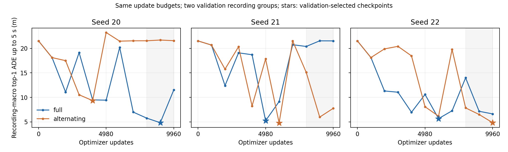

# MTR 上下文训练稳定性：六次等预算实验

本报告来自六次实际原 CMP MTR 训练，每次 10 轮 × 996 次更新，共 59,760 次更新。训练方式与种子在运行前固定，见 [协议](mtr_stability_plan.md)。原始实验保留。

所有运行使用同一原初始化；其完整上下文验证 top-1 ADE5 为 21.519 米。

## 结果

单位为米。完整上下文 top-1 ADE5 先在各录制组内平均，再对两个验证录制组等权平均。末三轮均值用于选择训练方案；最佳检查点仍按单次验证指标选取。

| 方案 | 种子 | 第 10 轮 | 第 8–10 轮均值 | 最佳 ADE5 | 最佳轮 |
|---|---:|---:|---:|---:|---:|
| full | 20 | 11.537 | 7.382 | 4.841 | 9 |
| alternating | 20 | 21.563 | 21.602 | 9.342 | 4 |
| full | 21 | 21.523 | 21.148 | 5.247 | 5 |
| alternating | 21 | 7.772 | 9.628 | 4.804 | 6 |
| full | 22 | 6.631 | 9.261 | 5.676 | 6 |
| alternating | 22 | 4.839 | 6.404 | 4.839 | 10 |

| 方案 | 末三轮均值的跨种子平均 | 各种子范围 | 全部种子优于原初始化 |
|---|---:|---|---|
| full | 12.597 | 7.382–21.148 | True |
| alternating | 12.545 | 6.404–21.602 | False |



## 冻结选择

按预先固定规则选择 `full`，下游使用预先指定的 seed=20、第 9 轮验证最佳检查点：

`/root/autodl-tmp/ToolV2X/outputs/mtr_stability_v1/full_seed20/best_model.pth`

冻结记录：`outputs/mtr_stability_v1/frozen_model.json`。此选择使用验证集，不代表独立测试结论。

## 相同 ROI 目标与实际训练量

下表使用各次运行的验证最佳检查点。完整来源上下文后取 ROI 目标，与仅 ROI 历史的输入条件不同；不得将二者混称同信息对照。

| 方案 / 种子 | 完整上下文的 ROI 目标 ADE5 | ROI 内历史 ADE5 | 监督中心呈现数 |
|---|---:|---:|---:|
| full / 20 | 6.169 | 5.870 | 72402 |
| alternating / 20 | 10.614 | 12.217 | 55581 |
| full / 21 | 6.054 | 6.850 | 72771 |
| alternating / 21 | 5.163 | 5.526 | 55491 |
| full / 22 | 5.415 | 6.363 | 72894 |
| alternating / 22 | 5.206 | 6.290 | 55579 |

## 复核与限制

- 另有第 5 组中断尝试：已落盘第 1 轮 996 步，落盘后是否还有额外更新未知；完整归档后以相同初始化和 seed22 从头重跑。中断尝试不进入六次完整运行的 59,760 步合计或选模，记录见 `outputs/mtr_stability_v1/interruption.json`。
- 六次原网络训练均保存真实参数更新、best/last 检查点、逐轮报表和选中权重重载结果；各自独立审计在 `outputs/mtr_stability_v1/*_audit.json`。
- 每个种子的两方案第 1 轮均为相同完整上下文；另核对该轮监督计数、平均训练 loss 及验证值一致，差异从第 2 轮开始引入。
- 独立 float64 公式复算原始与所选检查点的预测，核对身份、标签覆盖、录制组、更新预算和检查点元数据。末三轮均值另从逐轮报表的录制组指标复算；未将其表述为每轮原始预测都已独立重算。
- 每次验证均为相同 216 个来源窗口，full/full_on_roi/roi 合计 7,256 条目标/上下文记录，不能当成独立样本数。
- 两方案的更新次数和验证机会相同；监督中心数、ROI 采样重复与实际计算量不同。本次比较训练方案，不能单独识别上下文、中心分布、BatchNorm 或优化噪声的因果作用。
- 部分运行与独立驾驶接入或依赖构建并行，墙钟耗时只是过程记录，不用作公平速度比较。
- 仅三个种子、两个验证录制组；原初始化/检测缓存训练来源以及原 CUDA 算子一致性限制保留。未来 GT 只供离线监督与评价。
- 共享驾驶模型尚未在本阶段更新，本报告不提供 P/F 驾驶收益、查询策略收益或闭环结论。

## 重放

使用 README 的完整模型环境，对六个组合分别运行：

```bash
python src/prediction/train_mtr.py NEW_OUTPUT --seed SEED --context CONTEXT --steps-per-epoch 996 --epochs 10 --patience 11 --checkpoint /root/autodl-tmp/CMP/MTR/output/v2v4real_multiego_no_coop/ckpt/best_model.pth
python tests/verify_mtr_adaptation.py NEW_OUTPUT NEW_AUDIT.json
```

完整运行命令与日志保存在 `outputs/mtr_stability_v1/run_study.py` 和对应日志；汇总脚本为同目录的 `analyze.py`。
