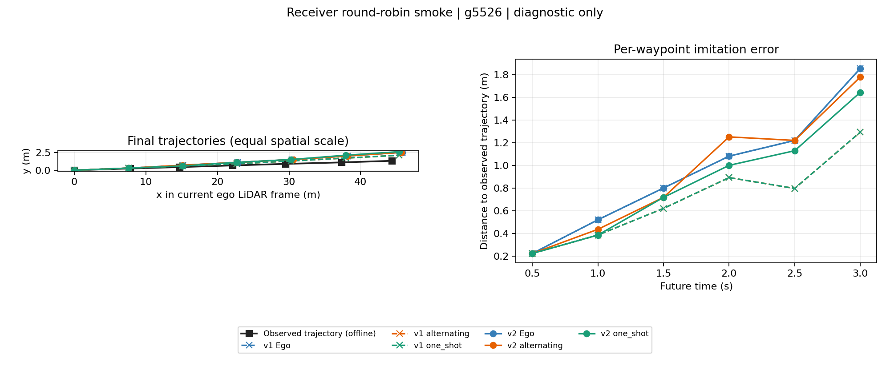
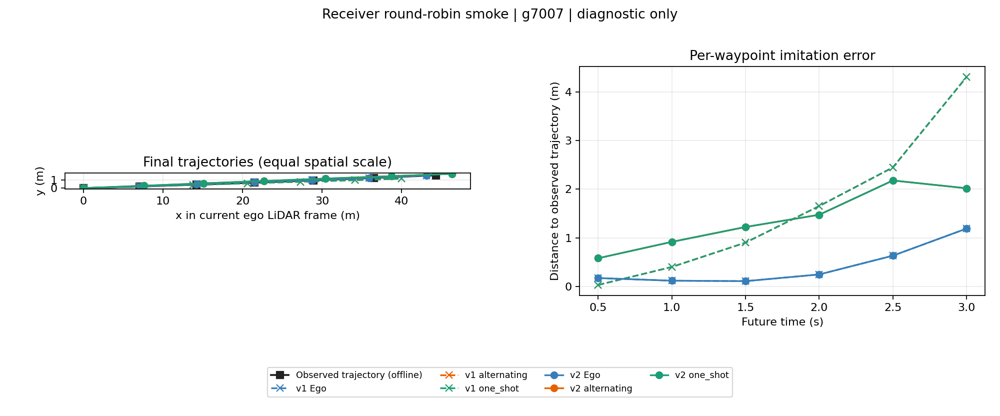

# 共同 receiver 轮询：两帧真实联调

日期：2026-09-14。状态：**修正后的真实运行完成，12/12 任务成功、24/24 次 GoT 输出合法；共同 receiver v2 确实把最终目标覆盖从 1 个提高到 2 个，但两个样本上的离线误差一升一降，不能声称驾驶收益。**

## 1. 实际执行与结论边界

本次只检查共同 receiver 从默认 v1 改为显式 opt-in 的稳定目标轮询 v2 后，真实两帧调用链能否保留更多目标覆盖，以及差异是否实际进入 GoT 输入。使用预声明 validation 样本 `g5526`、`g7007`；每帧运行 Ego、诊断 alternating、诊断 one-shot，在两个 receiver 下各一次，共 12 个任务。

模型冻结为 GoT `framework_baseline_restart_v1/training/checkpoint-epoch01` 与 CMP MTR `mtr_stability_v1/full_seed20/best_model.pth`。MTR 实际载入 epoch 9、880 项权重，missing/unexpected 均为 0。没有训练、参数更新、扩帧、分支枚举或重建缓存。

每个任务重新调用原 runtime factory，生成独立 local input、service 与 provider 状态。没有把旧归档的第二次回答或其他任务的返回接入新方案。在线路径不读 GT；推理结束后才读取既有 validation 观测轨迹计算 ADE3/FDE3。

这不是训练后的 value policy、strong one-shot 公平效果实验、驾驶收益实验或闭环评价。共同 receiver helper 是工程合同修正，不是创新性结论。原 one-shot 的 `per_rpc` 外层预算与 alternating 的逐原语 cap 不等价，按批准范围保留，因此两种诊断策略之间不能作公平效果归因。

## 2. 第一次环境失败单独保留

第一次 `_v1` 尝试完成模型加载后，因没有显式设置 `TOOLV2X_V2VGOT_ROOT`，数据根错误解析到 `/root/autodl-tmp/ToolV2X/.worktrees/V2V-GoT`。12 个任务都在输入构造、episode 创建和 GoT 调用前以 `FileNotFoundError` 终止：GoT 0 次、provider 返回 0、在线 GT 读取为 false。

该归档保留在 `/root/autodl-tmp/ToolV2X/outputs/receiver_round_robin_smoke_2026_09_14_v1/`，是可恢复的环境设置失败，**不是方法质量失败或 receiver 结果**。修正运行使用全新 `_v2` 目录，显式固定 V2V-GoT、CMP、LLaVA base 和 CLIP 根路径，没有覆盖或复用 `_v1` 任务。

## 3. 冻结配置与真实输入链

除 receiver version 外，两个 receiver 的数值完全一致，并与 2026-09-13 原 smoke 保持相同样本、execution spec、上下文 4096、generation reserve 256、peer reserve 1536、两位小数、本车块、max targets=4、请求/返回/episode bytes 上限、轨迹合法性阈值、控制规则和 utility 壳。v1 仍是默认行为。

GoT 实际输入为当前/前一帧点云产生的 regression/classification maps、detection boxes、因果 ego motion 和已入模远端字段。`actual_rgb_input=false`，`point_cloud_feature_input=true`；运行 direct Q9，没有 Q8，也没有将动作施加回 CARLA。CMP 使用 causal adapter 和 portable torch operators；没有验证 native CUDA 算子等价，GoT 与 MTR 的完整原始训练来源均未核实，不能称为原发布流水线的完整复现。

修正运行用时 75.738 秒，其中一次模型加载 13.401 秒。源码、vendor、launch、样本索引和 wrapper 在运行前做字面快照；runner 在模型加载前检查快照后漂移。所有 12 个任务成本完整，24 个 plan 全部 parse-valid、admissible 且 raw/saved record 一致。

## 4. 两帧调用链与入模证据

四个 alternating 任务的 P 后轨迹都发生变化，因此都实际发送 F(change)。逐任务检查确认：第二请求的 `tau_new` 与该任务阶段 1 的真实新轨迹逐点一致，`tau_old` 与阶段 0 初始轨迹一致；provider 保存的实际 request 与 episode request 相同。没有用合成 F 或旧回答。

P 排序在两个 receiver 间相同：g5526 为 `[20,0,4,6]`，g7007 为 `[0,5,11,21]`，均返回 4 个目标、8 个字段。v1 在 P 后保留同一最近目标的 history 与 receiver-subset forecast；v2 保留两个目标的 forecast。最终每条工具路径都保留 2 个 remote units，但 v1 是同目标两种 context，只有 3 个非重复入模远端字段；v2 覆盖两个目标，共 4 个入模远端字段。

| 帧 | receiver / 路径 | 实际 F 排序 | returned targets / 字段数 | 最终 admitted Z |
|---|---|---|---|---|
| g5526 | v1 alternating | `[6,20,3,8]` | `{3,6,8,20}` / 6 | target20 provider-full forecast + target20 receiver-subset forecast |
| g5526 | v1 one-shot | `[3,6,20,4]` | `{3,4,6,20}` / 5 | target20 provider-full forecast + target20 receiver-subset forecast |
| g5526 | v2 alternating | `[0,3,20,4]` | `{0,3,4,20}` / 5 | target20 provider-full forecast + target6 receiver-subset forecast |
| g5526 | v2 one-shot | `[3,6,20,4]` | `{3,4,6,20}` / 5 | target20 provider-full forecast + target6 provider-full forecast |
| g7007 | v1 alternating | `[0,21,5,11]` | `{0,5,11,21}` / 4 | target0 provider-full forecast + target0 receiver-subset forecast |
| g7007 | v1 one-shot | `[0,5,2,21]` | `{0,2,5,21}` / 5 | target0 provider-full forecast + target0 receiver-subset forecast |
| g7007 | v2 alternating | `[5,29,2,0]` | `{0,2,5,29}` / 6 | target0 provider-full forecast + target5 provider-full forecast |
| g7007 | v2 one-shot | `[0,5,2,21]` | `{0,2,5,21}` / 5 | target0 provider-full forecast + target5 provider-full forecast |

g5526 的 v2 alternating 与 one-shot 最终虽然覆盖同样两个 target，但 target6 的 context 不同，最终输入分别为 3555 和 3472 tokens，所以最终 Z、prompt、raw answer 和轨迹都不同。g7007 两条 v2 工具路径最终都是 target0/5 的 provider-full forecast，最终 Z、prompt、raw answer和轨迹逐字一致。这解释了“g5526 新 alternating 不再与新 one-shot 重合、g7007 仍重合”，不能归因于策略优劣。

## 5. 离线轨迹结果

| 帧 | 路径 | v1 ADE3 / FDE3（米） | v2 ADE3 / FDE3（米） | v2 - v1 ADE3 / FDE3 |
|---|---|---|---|---|
| g5526 | Ego | 0.948969 / 1.854059 | 0.948969 / 1.854059 | 0 / 0 |
| g5526 | alternating | 0.700788 / 1.292016 | 0.936881 / 1.778120 | +0.236094 / +0.486105 |
| g5526 | one-shot | 0.700788 / 1.292016 | 0.849000 / 1.643314 | +0.148212 / +0.351298 |
| g7007 | Ego | 0.410510 / 1.189432 | 0.410510 / 1.189432 | 0 / 0 |
| g7007 | alternating | 1.623345 / 4.309533 | 1.398179 / 2.019000 | -0.225165 / -2.290533 |
| g7007 | one-shot | 1.623345 / 4.309533 | 1.398179 / 2.019000 | -0.225165 / -2.290533 |

alternating 的逐阶段 ADE3 为：g5526 v1 `0.948969 → 0.852557 → 0.700788`，v2 `0.948969 → 0.900352 → 0.936881`；g7007 v1 `0.410510 → 1.623345 → 1.623345`，v2 `0.410510 → 1.447729 → 1.398179`。v1 g7007 的 F 后合法轨迹未变，仍保留为一次有效负结果；其余反馈阶段均改变轨迹。

v2 在 g5526 相对 v1 变差，在 g7007 相对 v1 变好，但 g7007 的两个工具结果仍明显差于 Ego 的 0.410510 / 1.189432。两个样本没有统计功效，且策略预算不等价。这批证据支持“轮询改变并扩大了目标覆盖，真实 GoT 会响应变化”，不支持“误差稳定降低”“驾驶更安全”或“alternating 优于 one-shot”。

## 6. 完整成本与旧归档复现

| receiver | GoT / outer RPC / P-F 原语 | request / response bytes | GoT input / output tokens | 已测非重叠计算（秒） |
|---|---:|---:|---:|---:|
| v1（6 任务） | 12 / 6 / 8 | 14,345 / 108,783 | 35,469 / 756 | 26.1310 |
| v2（6 任务） | 12 / 6 / 8 | 14,345 / 108,866 | 34,736 / 756 | 25.8813 |

v2 总输入少 733 tokens；请求 bytes 完全相同，返回多 83 bytes。计算时间受顺序、缓存、热身及部分同期回归测试影响，不是稳定测速，不能据 0.250 秒差值声称速度提升。逐任务完整成本见 [results.csv](evidence/receiver_round_robin_2026_09_14/results.csv)，逐阶段见 [stage_metrics.csv](evidence/receiver_round_robin_2026_09_14/stage_metrics.csv)。

对 2026-09-13 原归档完成了复现检查：12 个任务新构造的 ego feature/local forecast 数组逐项 dtype、shape、值一致；6 个 v1 任务的全部 12 个对应阶段，其 prompt、入模证据、raw answer 和轨迹均与旧归档一致。v2 的初始本车输入、prompt、raw answer 和轨迹也与 v1/旧归档一致，差异从第一次远端证据入模后才出现。wire bytes 未被宣称逐字相同；实际 receipt 和计时仍来自本次新请求。

## 7. 回归与独立复核

- 完整轻量回归 **302/302 通过**；完整模型环境回归 **358/358 通过**。两套结果分别统计，不能相加成不同测试数。
- 模型环境首次回归有两个用例缺少 worktree 的既有 paired fixture 路径。补齐指向原始 frames 的链接后，两个定向用例和完整 358 项均通过；初始失败日志保留，没有修改数据或训练模型。
- 默认 v1 的旧归档 12 阶段精确复现；固定 Ego/P/F/PF/rule 的 5 个共同 receiver 合成契约检查通过。合成检查不作为真实模型收益证据。
- 独立终审规格、质量和两帧真实联调均 PASS，无必须修复项。独立复算覆盖真实 τ1→F 绑定、原始轨迹误差、wire bytes、token 和非重叠成本，不能据此推出策略优越性。

见 [完整轻量日志](evidence/receiver_round_robin_2026_09_14/verification/full_light.log)、[完整模型环境日志](evidence/receiver_round_robin_2026_09_14/verification/full_model_environment_final.log)、[独立复算](evidence/receiver_round_robin_2026_09_14/verification/root_independent_audit.json) 和 [终审记录](evidence/receiver_round_robin_2026_09_14/verification/final_review.md)。

## 8. 归档

完整原始归档位于 `/root/autodl-tmp/ToolV2X/outputs/receiver_round_robin_smoke_2026_09_14_v2/`，含 12 个 tasks、16 个真实 provider primitive records、12 个 outer responses、wire、receipt、ledger、fresh NPZ、所有 stage prompt/raw answer/轨迹、模型身份、冻结代码和离线评价。环境失败归档 `_v1/` 独立保留。

仓库精简证据：

- [执行摘要](evidence/receiver_round_robin_2026_09_14/summary.json)、[逐任务结果](evidence/receiver_round_robin_2026_09_14/results.csv)、[receiver 配对](evidence/receiver_round_robin_2026_09_14/receiver_comparison.json)。
- [provider 流程](evidence/receiver_round_robin_2026_09_14/provider_flow.csv)、[最终 admitted Z](evidence/receiver_round_robin_2026_09_14/final_admitted_z.csv)、[逐阶段指标](evidence/receiver_round_robin_2026_09_14/stage_metrics.csv)。
- [旧归档复现](evidence/receiver_round_robin_2026_09_14/prior_archive_comparison.json)、[label access](evidence/receiver_round_robin_2026_09_14/label_access.json)、[第一次环境失败](evidence/receiver_round_robin_2026_09_14/environment_failure_v1.json)。
- [冻结配置](evidence/receiver_round_robin_2026_09_14/launch.json)、[运行环境](evidence/receiver_round_robin_2026_09_14/runtime_environment.json)、[模型记录](evidence/receiver_round_robin_2026_09_14/models.json)、[终态进度](evidence/receiver_round_robin_2026_09_14/progress.json)。

本轮停止在两个预声明帧的 receiver 机制联调。没有自动进入训练、扩帧、闭环、价值策略拟合或 strong one-shot 公平对照。
