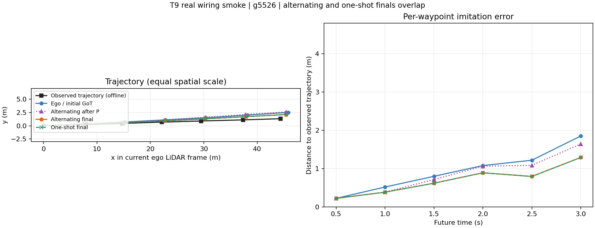
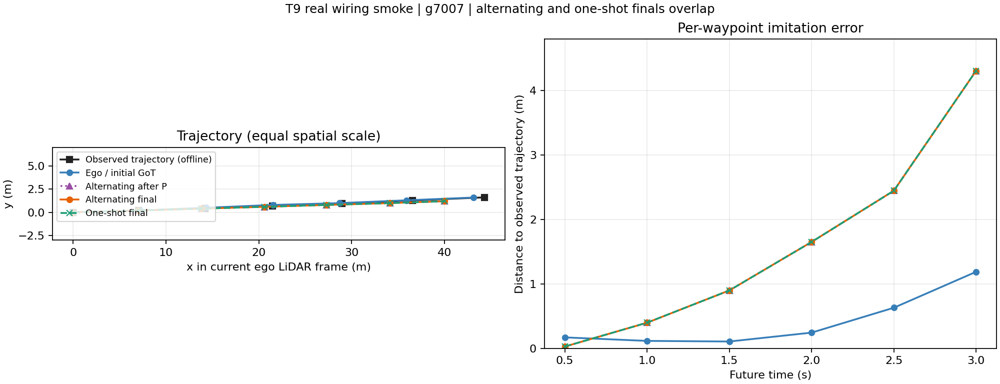

# T9 两帧真实联调：执行完成与后续检查点

日期：2026-09-13。范围：用户授权的两个既定验证帧，Ego / 诊断交替 / 诊断单轮三条路径。本批已经结束。

**结论：真实链路在两帧上接通，6/6 任务成功、12/12 次原 GoT 输出可解析且通过冻结的轨迹合法性检查。没有训练或扩帧。两个工具臂最终证据和轨迹相同；第一帧改善、第二帧变差，不能据此声称方法收益。** 下一步应先检查接收端如何保留任务相关证据，再决定真实分支采集；无需重训底座或重建缓存。

## 1. 本次实际执行了什么

模型使用既有 GoT `framework_baseline_restart_v1/training/checkpoint-epoch01` 和 CMP MTR `mtr_stability_v1/full_seed20/best_model.pth`。MTR 实际加载元数据为 epoch 9，880 项权重，无 missing/unexpected keys。二者全部冻结；没有学习请求价值模块、联合训练或参数更新。

两个预声明样本分别为 `g5526`（`2022-03-17-16-06-11_0`）和 `g7007`（`2022-03-21-09-50-20_10`），均为相应验证录制组在线索引中的首个合法帧，`local_frame=10`。其文件位于物理 train archive，研究角色为 validation；没有访问 test。原 paired 索引显式投影为方法允许的因果字段，未加入标签。

| 路径 | 实际执行 | GoT 次数 / 外层 RPC / P或F原语数 |
|---|---|---|
| Ego | 初始 GoT → STOP | 1 / 0 / 0 |
| alternating | 初始 GoT → P(current) → 同一 GoT 修订 → F(change) → 同一 GoT → STOP | 3 / 2 / 2 |
| one_shot | 初始 GoT → 单个 bundle 内 P(current) → 看真实 P 返回后条件执行 F(current, initial candidate) → 返回后 GoT → STOP | 2 / 1 / 2 |

两帧的实际 P 后轨迹都与初始轨迹不同，交替策略才发送 F(change)，`tau_old/tau_new` 分别逐点绑定初始和修订轨迹。单轮第二原语只能使用预先发送的候选，没有中间 ego GoT。这批全部是诊断规则，**没有训练出的价值策略或 strong one-shot 策略**。

实际模型加载和六任务推理从 22:40:10 到 22:40:56（UTC+8），共 45.80 秒，其中加载 14.27 秒；回归、配置核对、离线复算和报告时间另计。逐阶段原始回答、请求、receipt、wire、ledger 和成本全部保留。模型任务无失败或重跑。

GoT 使用原 LLaVA 模型与 shallow projector，输入为当前/前一帧点云生成的 regression/classification maps、detection boxes 及因果 ego motion；**没有真实 RGB，执行 direct Q9，没有 Q8，也没有闭环驾驶**。CMP 使用项目既有 causal adapter 和 portable torch operators；本次未验证 native CUDA 算子等价，也未新增完整上游训练来源审计。

## 2. 固定的执行参数与控制边界

完整配置在本地 `outputs/t9_real_smoke_2026_09_13_v1/launch.json`，每臂完整冻结规格在 `specs/`，均在模型执行前确定。运行根也保存字面代码快照与模型加载记录。

- ExecutionSpec profile 为 `real_smoke_v1`：sigma=5 m、max_targets=4，request/response/episode 上限分别为 16,384 / 65,536 / 196,608 UTF-8 bytes；最多两次远端原语。
- 保留现有几何代理与异常轨迹阈值：外接圆、车长 4.8 m/宽 2 m，速度 80 m/s、加速度 30 m/s²。阈值是运行参数，合法性通过不代表安全性。
- 共同 receiver：context=4096、generation reserve=256、peer reserve=1536、数值两位小数，本车块固定。
- 首批采用预先声明的宽松 wire cap，用于真实接入，不作预算优化。单轮 `per_rpc` 扣除 2048-byte wrapper reserve 后，内部每原语上限 31,744，交替每原语为 65,536；这是规格上的差别。本次实际 primitive wire 约 12.8/14 KB，未触及任一上限，目标裁剪来自 max_targets=4。
- 冻结 utility 的 ADE=1、成本权重=0 仅满足诊断运行规格结构，本批没有用它拟合策略或选择动作；不代表已校准正式研究效用。

这只是两帧接入检查，不能充当等预算 strong one-shot 公平效果实验，也没有运行 same-evidence extra-generation、old/union 或旧五策略全对照。既有实现与旧基线保留。

## 3. 真实 P/F 与已购／入模证据

四次 P provider 记录均为 MTR targets=0、model time=0。P 排序代理是 **causal tracking-state motion proxy**；`history_valid` 不等于逐帧 detector hit。P 返回后，receiver 用实际购买的四目标历史子集运行一次冻结 MTR。不能把“P 无远端 MTR”写成“整个 P 路径没有 MTR”。

F 在裁剪前计算完整合法 peer context：g5526 为 30 个目标，其中 27 个走 MTR、3 个短历史 fallback；g7007 为 19 个目标，全部走 MTR。返回的四个目标 forecast 标记 `provider_full_at_t`。P 的 receiver-subset forecast 与 F 的 provider-full forecast 保持不同 context；本批 P 没有购买完整 context，**没有执行 P 完整上下文／本地 MTR 与 F 的同信息数值等价实验**。

第二次返回对已有合法 receipt 证明的 anchor 使用引用，未重复购买相同字段。receiver 的 subset forecast 不会充当 provider 的完整预测。T2 远端字段去重和 T3 派生／入模记录保持分离。

| 帧／路径 | 最终 acquired 字段 | receiver-derived 字段 | 最终入模远端字段引用 | 最终保留 remote units |
|---|---:|---:|---:|---:|
| g5526 alternating | 14 | 4 | 3 | 2 / 12 |
| g5526 one_shot | 13 | 4 | 3 | 2 / 12 |
| g7007 alternating | 12 | 4 | 3 | 2 / 12 |
| g7007 one_shot | 13 | 4 | 3 | 2 / 12 |

每个最终入模集合包含同一目标的 anchor、一份 receiver-subset forecast 和一份 provider-full forecast；两份预测 context 不同，不能直接当成重复信息删除。P 后中间阶段则保留同一目标的 history 和 subset forecast。每次裁剪都有字段及提示位置记录。

**服务端检索差异确实存在，但本批没有传到最终 GoT 输入。** g5526 的交替 F(change) 排序为 `[6,20,3,8]`，单轮 F(current) 为 `[3,6,20,4]`；g7007 分别为 `[0,21,5,11]` 和 `[0,5,2,21]`。共同 receiver 在 1536-token peer reserve 下只留下最近目标的两份预测（g5526 target20，g7007 target0），因此两臂最终 remote Z 相同。这里 current/change 还使用不同轨迹，不能用这次比较单独归因 mode 的效果。

## 4. 离线结果与费用

模型推理退出后才读取既有 `paired_driving_data_v1/offline_labels/validation.jsonl`。标签是实际观测 ego 轨迹，六个点覆盖 0.5–3 秒；它是模仿误差参考，不能直接判断碰撞或最优规划。完整负结果保留。

| 帧 | 路径 | ADE3（米） | FDE3（米） | request / response bytes | 已测非重叠计算（秒） |
|---|---|---:|---:|---:|---:|
| g5526 | Ego | 0.948969 | 1.854059 | 0 / 0 | 2.0774 |
| g5526 | alternating | 0.700788 | 1.292016 | 4122 / 26961 | 6.7589 |
| g5526 | one_shot | 0.700788 | 1.292016 | 3030 / 27477 | 4.4135 |
| g7007 | Ego | 0.410510 | 1.189432 | 0 / 0 | 1.9005 |
| g7007 | alternating | 1.623345 | 4.309533 | 4134 / 26785 | 6.7300 |
| g7007 | one_shot | 1.623345 | 4.309533 | 3059 / 27561 | 4.3897 |

交替阶段 ADE：g5526 为 `0.948969 → 0.852557 → 0.700788`；g7007 为 `0.410510 → 1.623345 → 1.623345`。后者 P 后开始偏离观测轨迹，F 后没有进一步改变轨迹。两帧上交替与单轮最终六点完全一致，没有显示交替的额外收益。

费用累计 local MTR、input build、driver attempt、service attempt、receiver update 和独立 control 时段。generation 和 peer/receiver MTR 属于这些阶段的内部子项，不再相加。它排除加载、未测记账、保存 I/O 和网络传输，**不是端到端延迟或稳定测速**。每任务独立执行，相同输入逐数组一致；首次 Ego local MTR 包含冷启动影响。

图中保留初始、P 后、交替最终和单轮最终；终轨迹重叠按原样画出，没有人为错位。

## 5. 验证、改动和归档

运行前模型环境完整 unittest：**345/345 通过，289.657 秒**，包含 v1 旧回归；日志保存于运行根 `preflight_tests.log`。真实运行没有修改 `src/`、`tests/` 或 vendor，冻结快照与执行工作树逐文件一致。运行后复用 `evaluate_method_task` 得到六任务 `task_success=true / cost_complete=true`，并用 NumPy 再算每阶段误差。

只读独立 agent 未调用仓库 evaluator，重新解析原文、重编码报文、检查 receipt/派生/Z、数组一致和非重叠成本，结果与正式离线归约一致。详见 [独立审计](evidence/t9_real_smoke_2026_09_13/independent_audit.md)、[六任务 CSV](evidence/t9_real_smoke_2026_09_13/results.csv)、[逐任务评价](evidence/t9_real_smoke_2026_09_13/evaluation_rows.json)。模型失败为零，因此没有用真实失败验证恢复行为；失败契约仍由现有测试支撑。

推理日志有 tokenizer 旧 2048 提示；实际 driver/receiver context=4096，12 次调用的已计输入均不超过 3702，再加预留 256 仍低于 4096，无实际截断或越界失败。离线绘图封装首次误写计时说明常量名，修正为已有 `METHOD_TIMING_SCOPE` 后运行成功；没有因此再次调用模型或修改研究源码。

本地大归档：`/root/autodl-tmp/ToolV2X/outputs/t9_real_smoke_2026_09_13_v1/`，包含：

- `launch.json`、`selected_index.jsonl`、`specs/`、`code_version.json` 和 `code_snapshot/`：执行前固定规格与字面源码。
- `run_smoke.py`、`models.json`、`inference.log`、`progress.json`：真实执行入口、模型与终态。
- `tasks/`：全部原始输出、报文 bytes、每阶段 evidence/derived/Z、事件及成本；`inputs/` 保存特征、预测数组和真实 provider 记录。
- `evaluate_smoke.py`、`offline/`：独立进程离线归约入口、选定标签、逐任务指标、阶段追踪和两帧图。该 smoke 根是轻量封装归档，使用所附脚本调用既有逐任务 evaluator；不是标准 `interact` 目录，不能直接套总目录 CLI。

新增报告、图及精简证据归档；更新 README/STATUS 的当前状态。T9 准备代码已经本地提交 main，提交标题为 `Prepare T9 frozen value execution and audited one-shot supervision`。本次没有推送 GitHub。

## 6. 下一步建议与停止边界

先用**本次保存的两帧**核对“服务排序 → 装包 → receiver 选取 → GoT 可见字段”的全过程，列出被丢弃的任务相关字段及保留理由。当前可确认的是 receiver 距离排序/预算把两种检索的实际差异丢掉；不能直接认定所有场景都有此问题，也不能仅凭第二帧变差认定底座训练失败。

据此决定一个最小、所有对照共用的 admission 调整是否符合现有方案，同时检查同目标 subset/full 预测的表示成本；不能预先按方法名为交替分配更大预算，或删掉 context 不同的预测冒充同信息去重。修订后若需生成，仍应先做独立授权的小批；真实分支采集、价值拟合与 strong one-shot 公平拟合排在后面。

本批停在两帧真实联调和结果核对。没有自动进入训练、分支枚举、大样本实验、RSU/I、新预测骨干或 peer 学习排序。
