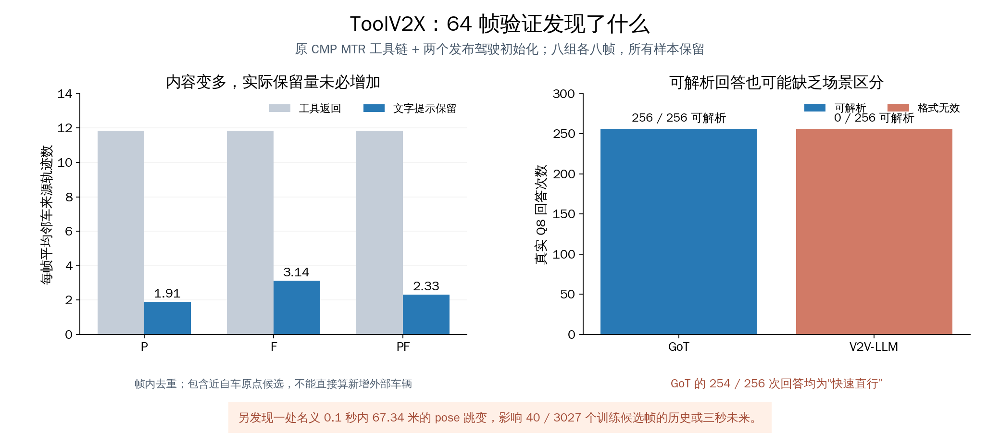

# 64 帧核查：先看模型实际收到了什么

本轮已完成八个训练录制组各八帧的四动作准备、两个原驾驶初始化共 512 次真实 Q8，以及 12 张场景图。结论：下一步应先修正时间连续性和证据接收问题，再进入正式驾驶适配。当前框架已能承载验证，暂不需要继续扩展模块。

## 一条样本究竟怎样经过系统

自车先保留自己当前和上一帧检测器的浅层点特征，共 540 个特征 token，同时拿到当前速度和转动速度。它也有自车跟踪目标的 MTR 预测。

- Ego：以上自车输入。
- P：再请求邻车的可用历史，由自车用同一 MTR 计算预测。
- F：再请求邻车用 MTR 已计算好的预测。
- PF：同时保留 P 和 F 两种来源的记录。

随后，接收端按当前距离优先选取完整目标记录，放入有限长度的文字提示；最后原驾驶模型回答 Q8，即速度类别和方向类别。P 的文字同时包含历史和预测，比 F 更长。PF 对同一邻车轨迹可以保存两条能力记录，因此记录数不等于外部车辆数量。

模型没有收到真实 RGB 图片。图来自检测/因果跟踪重建；被删掉的灰色框表示对应文字记录没有进入提示，自车浅层点特征仍在。绿色自车未来仅供离线解释，不进入工具或 Q8。该轮未生成 Q9 轨迹或更新参数。

## 输入链的计算一致，但发现了时间连续性异常

64 帧均按固定训练清单完成原接口、projector 和四动作；没有替换失败或低覆盖样本。每帧都加载 `outputs/mtr_stability_v1/full_seed20/best_model.pth`，其中 63 帧有目标并执行原 MTR 前向；g2762 两源为空，接口返回空结果而未执行网络前向。320 次预测接口调用中 315 次有原模型目标，累计原模型处理目标 3671 次（包含邻车四次重算，不是独立目标数）。同源完整历史下，P 本地重算与 F 的所有原始预测数组一致；空数组一致单列，不算模型计算证据。

该空帧也暴露了旧执行报告无条件把原 MTR 执行标为 true 的问题。已修正元数据为按实际原模型目标计数，新空帧回归确认前向为 false 且四动作证据完全不变。原 64 帧报告保留，以补充的真实活动计数为准。

独立用线性方程求解重新投影两源过去 11 帧的世界坐标轨迹，最大位置差 0.000213 米以内；六个自车未来标签时刻最大差约 1e-12 米，64 帧原生 Q8 标签类别也一致。没有发现点特征框超过 50 个而被截掉的样本。以上说明适配计算与缓存一致，不保证原缓存在时间上连续。

**实际异常是 g2760→2761 的自车 pose 平移了 67.34 米，而框架按 0.1 秒理解相邻保存帧。** 随后的 g2762，原始自车检测和邻车检测各 11 个、全部过 0.2 阈值，跟踪缓存却均为零。g2763 和 g2764 跟踪又恢复。原跟踪流程先将检测转到世界系，确认门槛为三次命中；这些缓存与代码支持“跳变后重新确认造成空窗”的解释，但尚未重跑跟踪内部匹配，也未确定是定位、缓存对应关系还是原始片段衔接的问题。

按追加的只读诊断规则（单个名义 0.1 秒间隔平移 >20 米或航向变化 >20 度），研究训练片段内 3912 个相邻间隔只有此处触发。它落入 40／3027 个训练候选帧的历史或三秒未来范围，固定抽样中影响 1／64 帧。该阈值用于定位复核点；未触发阈值不等于数据已全部干净，实际传感器时间戳也尚未验证。所有帧仍在本轮分母中。

## 大量工具内容没有进入文字提示

下表按全部 64 帧求每帧平均值；主格式 compact，固定 4096 上下文、两位小数、256 个生成 token 和 128 个 Q8 父回答余量。

| 动作 | 完整证据记录 | JSON 保留记录 | compact 保留记录 | compact 中唯一邻车来源轨迹 |
|---|---:|---:|---:|---:|
| Ego | 12.56 | 4.59 | 5.00 | 0 |
| P | 24.42 | 3.08 | 3.59 | 1.91 |
| F | 24.42 | 4.92 | 5.70 | 3.14 |
| PF | 36.28 | 3.97 | 4.72 | 2.33 |

这解释了为什么不能直接开始比较“哪个工具更好”：当前不同动作会改变文字长度、进入模型的目标集合和重复程度。PF 拿到更多记录，却比 F 保留更少的唯一邻车来源轨迹。在同信息条件下 P/F 的预测本来相同，因此上述差别不能解释为 F 预测更准确。

有 1 帧 P 返回了邻车目标，但最终没有任何邻车文字记录入模。固定前方区域 x∈[0,70]、y∈[-20,20] 内，64 帧累计 124 个未找到自车几何关联的候选，P/F/PF 分别保留 37/42/40 个。这里的累计数按帧计算，不是跨帧独立物体数；未关联不能证明是遮挡目标。

还发现 **59／64 帧的每种协作动作都保留了一个距自车原点 1.5 米内的邻车来源轨迹**，PF 对它保留两条记录。这可能包含邻车对自车的观测，身份尚未确认，不能直接计为新增外部车辆，也不能据几何位置断言无用。仅作几何敏感性核对、排除这一区域后，前方未关联候选累计为 97 个，P/F/PF 保留 10/15/13 个。此检查没有改变任何在线输入。

原 MTR 被保留的记录在两位小数下均保持六条不同路径，短历史回退单列；未为增加目标数量而减少模态。历史有效位表示因果跟踪器有状态，可能包括漏检时的卡尔曼预测，不等于每一帧都有匹配检测。

## 两个原驾驶初始化的真实回答

| 初始化 | 实际 Q8 生成 | 可解析 Q8 | 可检查的真实 Q9 父提示 | 父提示超预算 |
|---|---:|---:|---:|---:|
| GoT | 256／256 | 256／256 | 256 | 0／256 |
| V2V-LLM | 256／256 | 0／256 | 0 | 未检查：无有效父回答 |

两者都没有运行异常；V2V-LLM 的失败发生在回答格式解析。比如同一个速度/方向问题，它输出 `The suggested speed is [(14.8,0.4), ...]`，把轨迹数组放进了速度位置。原始回答完整保留，未改写成合法类别、未补 GT 父回答。

**GoT 格式全通过，但 254／256 次都回答 `fast / straight`。** 仅 2／64 帧在四动作间出现不同的可解析类别，且两个例外均为 Ego。与原生离线 Q8 标签完全一致的为 71／256 条；这些是同一 64 帧的四动作重复诊断，不是独立样本准确率估计。该结果说明现有发布初始化尚未表现出可靠的场景区分，不能把“格式可解析”写成已理解证据或驾驶有效。

GoT 实际 Q8 父回答组成的 Q9 输入最大 3709 token，加 256 生成余量仍在 4096 内；256 条真实标签监督序列也都在预算内。V2V-LLM 无有效父回答，当前监督生成器会跳过其 Q9 行。因此正式两阶段对照不能直接按相同 optimizer 步数比较：需要先解决任务回答格式/父回答方案，并固定相同轨迹监督曝光量。

两个初始化均尚未针对 ToolV2X 新驾驶输入正式适配。本轮未生成 Q9，未评估 ADE/FDE、碰撞或协作收益。Q8 实际生成总耗时 GoT 约 212 秒、V2V-LLM 约 816 秒；不含模型加载、证据生成和离线检查。

## 标签和图怎样理解

固定样本有 57／64 个“直行”标签，8 个“停车”标签。全体训练标签中 2744／3027 为“直行”，约 90.7%。原生 Q8 的方向类别来自未来净位移方向，不能当作实测方向盘角度或制动决策。

初次离线选图发现一个解释错误：g2762 三秒净位移仅 0.023 米，厘米级位置抖动却令路径切线累计角得到 626 度。已保留首次输出，并修正为低位移时不解释切线转向；转向展示改用 pose 航向并要求足够位移。真正的明显转向例为 g3539，三秒 pose 航向变化约 49.36 度。g2762 继续保留为跟踪缺口例，未从统计中删掉。

[本机图集](../outputs/training_evidence_audit_v1/offline/gallery.html) 中 12 个案例覆盖八个录制组、密集场景、前方证据丢失、转向和跟踪缺口，可展开查看两个初始化的 PF 回答原文。建议先看案例 42（前方目标怎样被截掉）、24（真实转向）、20（检测仍在而跟踪为空）。

## 当前建议的推进顺序

1. 查清 g2761 的原始时间/位姿对应关系，确定连续片段边界。若数据边界改变，需要按最终规则重建受影响窗口和标签，并评估已冻结 MTR 的适配数据是否需重做；不能只删这次图中的一帧。
2. 修正接收端重复表示、近自车原点候选的身份处理和前方目标保留规则，再用同一清单复查。保持六模态和真实源信息，先让 P/F/PF 的比较解释得清楚。
3. 依据完整 Q8 结果，固定两个初始化自己的父回答生成/失败处理，以及相同轨迹监督曝光量，再做正式驾驶适配和四动作配对评价。

框架已足够承载这些验证。该轮发现支持先处理具体输入问题；不能据此宣布 ToolV2X 方法有效或无效，也没有评估协作收益、碰撞或闭环表现。

运行目录：`outputs/training_evidence_audit_v1/`。计划、脚本、源码副本、原始响应、逐帧证据、全部 Q8 原文、离线复算和图分别保存；旧实验未改。

最终验证：完整 97 项测试、轻量 72 项测试通过。独立复核全部 64 帧的原预测数组与 512 行容量统计，并逐条核对 512 次 Q8 的样本、真实执行和失败记录；63 帧有原模型前向、1 帧为空。两轮只读审查未留下未处理的重要代码问题；数据连续性异常和驾驶任务表现仍是实质限制，测试通过不覆盖这些研究问题。
